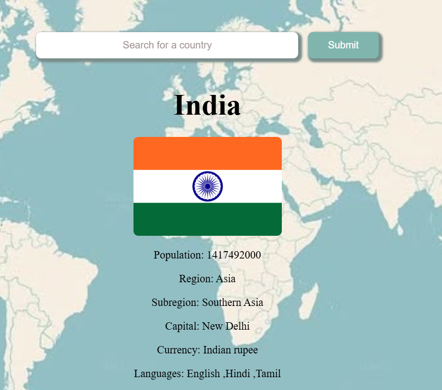

## Country Search App
A simple web application that allows users to search for any country and view important details such as population, region, capital, currency, languages, and national flag.
The application uses the REST Countries API to fetch country information.

## Live Features

 * Search any country
 * View country flag
 * Region and subregion information
 * Population details
 * Capital city
 * Currency
 * Languages
 * Search box clears after submit
 * Search bar stays centered
 * Background image design
 * Error handling for invalid countries

## Built With

* HTML
* CSS
* JavaScript
* Fetch API
* REST Countries API

